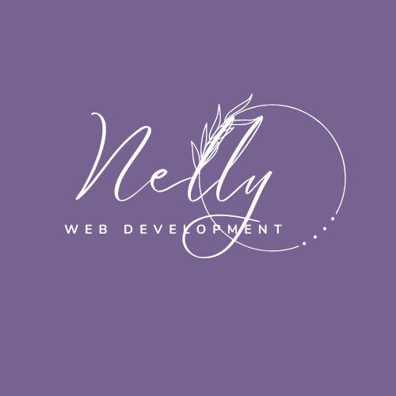
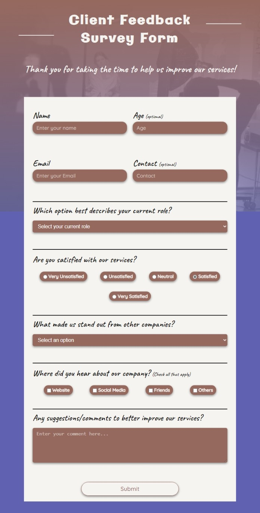

<a name="readme-top"></a>

<div align="center">
  
  <br/>
  <h3><b>Survey Form README</b></h3>
  <br/><hr /><hr /><br/><br/>
</div>

<!-- TABLE OF CONTENTS -->

# Table of Contents 📋


- [About the Project](#about-project)
  - [Screenshot](#screenshot)
  - [Built With](#built-with)
    - [Tech Stack](#tech-stack)
    - [Key Features](#key-features)
  - [Live Demo](#live-demo)
- [💻 Getting Started](#getting-started)
  - [Prerequisites](#prerequisites)
  - [Setup](#setup)
  - [Deployment](#deployment)
- [Authors](#author)
- [Future Features](#future-features)
- [Contributing](#contributing)
- [Show your support](#support)
- [Acknowledgements](#acknowledgements)
- [License](#license)

    <br/>
    <br/>
<!-- PROJECT DESCRIPTION -->

# <b>Survey Form</b> 📖<a name="about-project"></a>

**Survey Form** was one the the project built during Microverse the [Admissions Trial](https://github.com/anbehindY/yan-x-nelly).
This is a complete new version integrating new syntaxes as well as a better visual rendering<br/><hr /><br/><br/>

## <b>Screenshot 📷</b><a name="screenshot"></a><hr />

The screenshot below is a desktop version of the design.
<div align="center">
<br/>
 <br/><br/>
</div>
<p align="right">(<a href="#readme-top">back to top</a>)</p>
<br/><br/>

## <b>Built With 🛠</b> <a name="built-with"></a><hr />

### <b>Tech Stack </b><a name="tech-stack"></a>

This survey form is build with:

* Semantic <b>HTML5</b> markup to build raw structure of this web page
* <b>CSS</b> custom properties to make the website visually attractive
* <b>Node js</b> as a javascript runtime machine
[git], a free and open source distributed version control system
* <b>Linters</b> for coding convention and coding formating
<br/><br/>

<p align="right">(<a href="#readme-top">back to top</a>)</p>
<br/><br/>

<!-- Features -->

### <b>Key Features</b> <a name="key-features"></a>

- **Linters** have been set up in order to track possible errors from the HTML and CSS files
- **The stylesheet file** has been linked externaly

<p align="right">(<a href="#readme-top">back to top</a>)</p>
<br/><br/>

<!-- LIVE DEMO -->

## <b>Live Demo 🚀</b> <a name="live-demo"></a>
<hr />

You can see the live demonstration of this project [here]().

<p align="right">(<a href="#readme-top">back to top</a>)</p>
<br/><br/><br/><br/>

<!-- GETTING STARTED -->

## <b>Getting Started 💻</b><a name="getting-started"></a>

Before proceeding to the installation phase, you must ensure that you meet the following prerequisites...

### <b>Prerequisites</b>

- have a [Github account](https://github.com/)
- install the latest Long-term support version of [Node js](https://nodejs.org/en)
- install [Visual Studio Code](https://code.visualstudio.com/) and it extension _Live server_

### <b>Setup</b>

In order to run this project you need to:

- open your code editor
- create a folder with the name **_my-folder_**
- copy and paste the following code in your editor's terminal:
```sh
    cd my-folder
    git clone https://github.com/lily4178993/Survey-Form.git
```
- right-click on the _index.html_ file and select _Open with Live Server_

### <b>Deployment</b>

there are many ways to host your project for free:

- [GitHub Pages](https://pages.github.com/)
- [Vercel](https://vercel.com/)
- [Netlify](https://www.netlify.com/)

<p align="right">(<a href="#readme-top">back to top</a>)</p>

<!-- AUTHORS -->

## <b>Authors 👥</b><a name="authors"></a>
<hr /><br/>
This project had been buit with the colaboration of Alfie Yang.<br/>

Want to get in touch with us? Here are our social links:
> Nelly Telli:
* [GitHub](https://github.com/lily4178993/) <br/><hr />
* [Twitter](https://twitter.com/nelly_telli) <br/><hr />
* [LinkedIn](https://www.linkedin.com/in/nelly-t-330414266/)<br/>
> Alfie Yang:
* [GitHub](https://github.com/anbehindY) <br/><hr />
* [LinkedIn](https://www.linkedin.com/in/yan-min-thwin-192862215/)

<p align="right">(<a href="#readme-top">back to top</a>)</p>
<br/><br/>

<!-- CONTRIBUTING -->

## <b>Contributing 🤝 </b><a name="contributing"></a>
<hr /><br/>

Contributions, issues, and feature requests are welcome!
Feel free to check the [issues page](https://github.com/lily4178993/Survey-Form/issues).

<p align="right">(<a href="#readme-top">back to top</a>)</p>
<br/><br/>
<!-- SUPPORT -->

## <b>Show your support ⭐️ </b><a name="support"></a>
<hr /><br/>

Do you like this project? 
Don't hesitate to vote ⭐️! Kindly share it with someone who enjoys coding!

<p align="right">(<a href="#readme-top">back to top</a>)</p>
<br/><br/>
<!-- ACKNOWLEDGEMENTS -->

## <b>Acknowledgments 🙏 </b><a name="acknowledgements"></a>
<hr /><br/>

I am grateful to [Microverse](https://github.com/microverseinc) for the opportunity they have given me.I also thank Alfie Yang for his help.

<p align="right">(<a href="#readme-top">back to top</a>)</p>
<br/><br/><br/>
<!-- LICENSE -->

## <b>License 📝</b><a name="license"></a>
<hr />

This project is [MIT](./LICENSE) licensed.

<p align="right">(<a href="#readme-top">back to top</a>)</p>